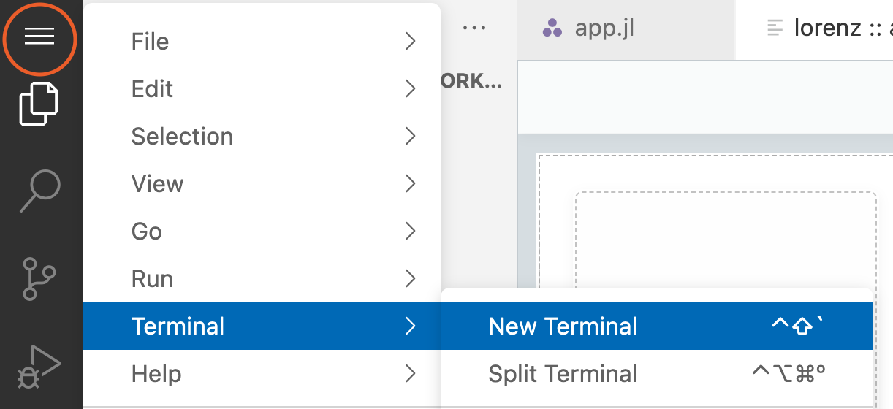

This repository contains apps ready to be deployed on [Genie Cloud](geniecloud.io), or loaded into [Genie Builder](https://marketplace.visualstudio.com/items?itemName=GenieBuilder.geniebuilder). For step-by-step tutorials, check out the [tutorials page](https://learn.geniecloud.io/tutorials).

To run the demos, sign up for a Genie Cloud account and follow [this guide](https://learn.geniecloud.io/guides/importing-genie-apps#bootstrapping-your-account-with-the-demos-repository). These steps are also valid for Genie Builder.

## Boostrapping your Genie Cloud account / Genie Builder

To preload these apps into your GC account, follow the steps below.

1. Open a terminal and go into `~.julia/geniebuilder/`
```bash
cd ~.julia/geniebuilder/


```
2. Remove the `apps` folder:
```bash
rm -rf apps
```
3. Clone this repository into a new `apps` folder:
```bash
git clone https://github.com/GenieFramework/GenieBuilderDemos.git apps

```

4. Go into `apps` and install the required packages for each app:
```
cd apps
```

```bash
for dir in */ ; do
  if [ -d "$dir" ]; then
    echo "Processing $dir"
    cd "$dir"
    julia --project=. -e 'using Pkg; Pkg.instantiate()'
    cd ..
  fi
done

```
